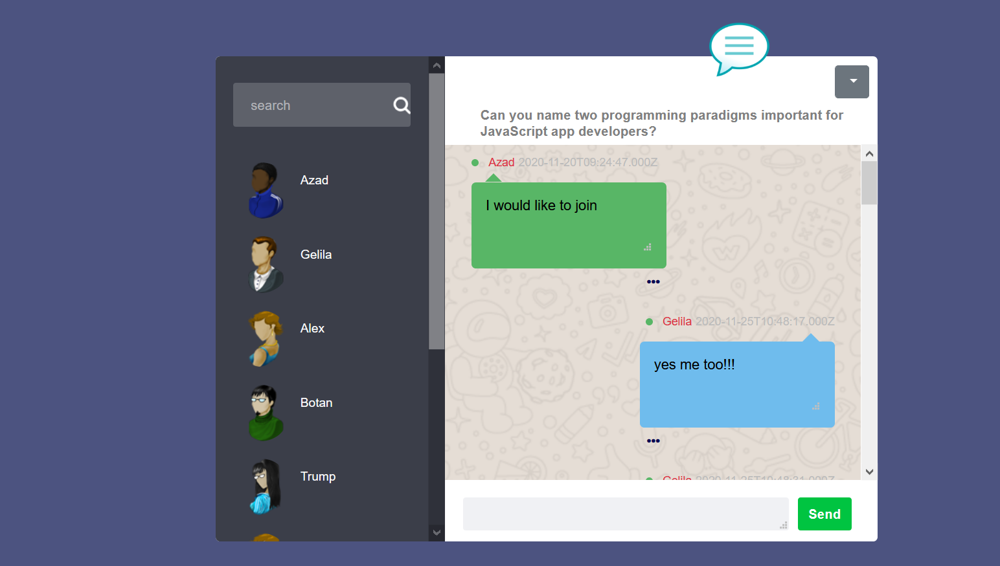

[![Contributors][contributors-shield]][contributors-url] [![PR][pr-shield]][pr-url] [![Issues][issues-shield]][issues-url] [![Forks][forks-shield]][forks-url] [![MIT License][license-shield]][license-url]

  <h3 align="center">Project: Chat-Forum</h3>

  

    Let's start to explore the project 🚀 
     
    <a href="https://github.com/mametur/chat-forum-Mysql/blob/main/README.md"><strong>Check the docs 📄</strong></a>
     
    <a href="">View Demo 💡</a>
    ·
    <a href="https://github.com/mametur/chat-forum-Mysql/issues/3">Report Bug 🐞</a>
    ·
    <a href="https://github.com/mametur/chat-forum-Mysql/pulls?q=is%3Apr+is%3Aclosed">Request Feature ⚒</a>
  

## Table of Contents

- [About the Project](#about-the-project)
  - [Built With](#built-with)
  - [Debuggers](#debuggers)
- [Contributing](#contributing)
- [License](#license)
- [Acknowledgements](#acknowledgements)

## About The Project

This project is designed by two Junior student developers who have a passion to create a chat-forum that can act as a place to discuss various IT related topics.The plan is to update it as the developers learn more techniques and widen the capabilities of the chat-forum. We would like to thank [HYF](https://hackyourfuture.be/) for giving us the opportunity to learn, explore and force our self to do better each day .

### Built With

- [Visual studio code](https://code.visualstudio.com/)
- [GitHub](https://github.com)
- [JavaScript](https://www.javascript.com/)
- [Node.JS](https://nodejs.org/en/)
- [Mysql](https://www.mysql.com/)
- [Bootstrap](https://getbootstrap.com/)

## Debuggers

- Visual Studio Code debugger

## Contributing

We would like to learn from you also. Please,

1. Fork the Project
2. Create your Feature Branch (`git checkout -b new-branch`)
3. Commit your Changes (`git commit -m 'Add some AmazingFeature'`)
4. Push to the Branch (`git push origin new-branch`)
5. Open a Pull Request

<!-- LICENSE -->

## Developers

- [Gelila](https://github.com/gelilaa)
- [Mame Azad](https://github.com/mametur)

## License

Distributed under the MIT License. See [LICENSE](https://github.com/mametur/chat-forum-Mysql/blob/main/LICENSE) for more information.

<!-- MARKDOWN LINKS & IMAGES -->
<!-- https://www.markdownguide.org/basic-syntax/#reference-style-links -->

[contributors-shield]: https://img.shields.io/badge/5-Contributors%20-brightgreen
[contributors-url]: https://github.com/mametur/chat-forum-Mysql/graphs/contributors
[forks-shield]: https://img.shields.io/badge/-Forks-blue
[forks-url]: https://github.com/mametur/chat-forum-Mysql/network/members
[issues-shield]: https://img.shields.io/badge/-ISSUES-green
[issues-url]: https://github.com/mametur/chat-forum-Mysql/issues/3
[pr-shield]: https://img.shields.io/badge/-Pull%20Requests%20-blue
[pr-url]: https://github.com/mametur/chat-forum-Mysql/pulls?q=is%3Apr+is%3Aclosed
[license-shield]: https://img.shields.io/badge/-LICENSE-brightgreen
[license-url]: https://github.com/mametur/chat-forum-Mysql/blob/main/LICENSE
